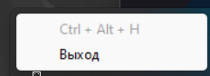
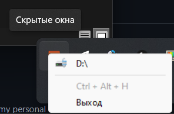

### Примечание
Программа для Windows (протестированно на Windows 11 basic и Windows 10 pro)

# Использование
Программа регестрирует под себя комбинацию "ctrl + alt + H" 

При нажатии этой комбинации активное окно скрывается, а в иконке трея появляется соответствующий пункт меню 

## Лицензия

[MIT](./LICENSE.txt)

**Free Software, Hell Yeah!**
